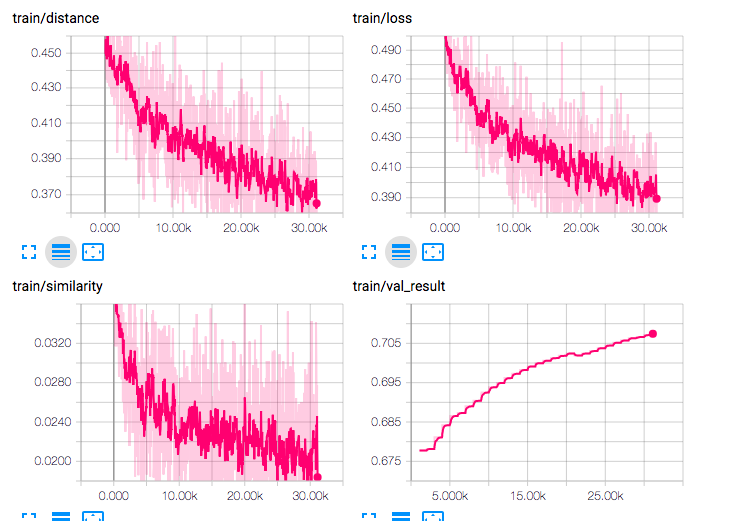
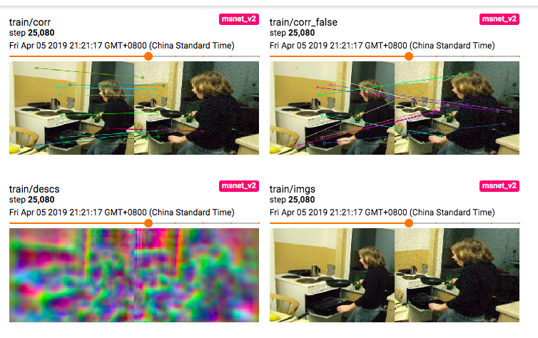

# Descriptor Space

Dense visual descriptor learning for wide-baseline matching, using the idea of "descriptor space". This project is still undergoing and some code can _not_ be made public. Here we only release the baseline code, and some current results. The project organization was inspired by [maskrcnn-benchmark](https://github.com/facebookresearch/maskrcnn-benchmark).

## Introduction

Visual descriptor is an important topic in computer vision. For establishing robust correspondences between images, the extracted descriptors should be invariant to changes like illumination, viewpoint and scale, etc. However, deep neural networks are intrinsically not invariant to scale and viewpoint changes, and forcing these invariance can be hard. Further, as we revealed, this can even be harmful to training.

In this work, we do not train the network directly to enforce scale invariance. Instead, we build a "descriptor-space", which is then used for matching. 

## Setup

This project uses Python3 and Pytorch. First, you will need to install package dependencies:

```
pip install -r requirements.txt
```

We use hard negative mining from [UCN](https://arxiv.org/pdf/1606.03558.pdf). This is written in cuda code, so you have to first bulid this. Run the following:

```
cd lib/utils/hard_mining
python setup.py build_ext --inplace
```

There might be some warnings.

## Dataset Preparation

For this work, we use [MSCOCO2017](http://cocodataset.org/#download) for training and [HPatches full sequences](https://github.com/hpatches/hpatches-dataset) for evaluation. The dataset should be downloaded under `data` and named `MSCOCO2017` and `HPATCHES` respectively. The directory structure should look like:

```
├── data
│   ├── HPATCHES
│   │   ├── i_ajuntament
│   │   ├── i_autannes
│   │   ├── ...
│   │   ├── v_abstract
│   │   ├── v_adam
│   │   ├── ...
│   └── MSCOCO2017
│       ├── annotations
│       │   ├── stuff_train2017_pixelmaps
│       │   └── stuff_val2017_pixelmaps
│       ├── test2017
│       ├── train2017
│       └── val2017
```

During training, random homographies are sampled and applied to COCO images, and so each training example contain a pair of images and a homography H. 

For evaluation, we tested on hpatches viewpoint and illumination dataset. We sample random keypoints use PCK (percentage of correct keypoints) with a threshold of 5 as metrics.

## Training

The baseline network called `MSNetV0` uses Resnet18. We simply extract descriptors at C3 layer. To train this network, run

```
python run.py --config ./configs/msnet_v0.yaml
```

It is possible to visualize the losses, validation results, and descriptor visualization using [tensorboardX](tttps://tensorboardx.readthedocs.io/en/latest). At project root, run

```
tensorboard --logdir==logs --port==6006
```

and visualize the results at port 6006 of your host, in the browser. Some example visualizations:





### Checkpoints

The checkpoints will be automatically saved under `data/model/msnet_v0` directory. You are free to stop training and resume later. The checkpoints will be automatically loaded. For testing, last checkpoint will also be loaded.

## Testing

We provide code for comparing three basic descriptors:

* `MSNetV0`, our baseline network
* [`SuperPoint`](https://github.com/MagicLeapResearch/SuperPointPretrainedNetwork)
* [`DAISY`](https://github.com/etola/libdaisy)

To test these on hpatches viewpoint dataset, run the following respectively:

```
python run.py --config ./configs/msnet_v0.yaml --test
python run.py --config ./configs/superpoing.yaml --test
python run.py --config ./configs/daisy.yaml --test
```

Note for superpoint, you will first have to download the pretrained model weight from [here](https://github.com/MagicLeapResearch/SuperPointPretrainedNetwork) to `data/model`.

Available test sets are `HPATCHES`, `HPATCHES_VIEWPOINT`, and `HPATCHES_ILLUM`. To test on a specific dataset, like `HPATCHES_ILLUM`, run

```
python run.py --config ./configs/msnet_v0.yaml --test DATASET.TEST HPATCHES_ILLUM
```

## Results

Here we provide some testing results with `MSNetV0`, `Superpoint`, `DAISY`, and two of our new networks based on descriptor space called `MSNetV1` and `MSNetV2`, on hpatches, hpatches viewpoint and hpatches illumination dataset. Details for these two networks are currently not publicly available. 

|            | All       | Viewpoint | Illumination |
| ---------- | --------- | --------- | ------------ |
| DAISY      | 0.592     | 0.535     | 0.647        |
| SuperPoint | 0.646     | 0.592     | 0.702        |
| MSNetV0    | 0.626     | 0.619     | 0.644        |
| MSNetV1    | **0.742** | **0.732** | **0.752**    |
| MSNetV2    | 0.690     | 0.719     | 0.657        |

